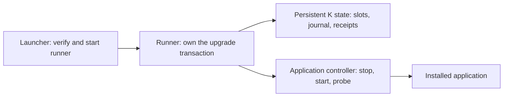

# K (k-carrier)

K is a framework for upgrading an application from a separate, disposable program.
It downloads and verifies the target executable, tries it in a second slot, checks
that the service is ready, and either commits the upgrade or restores the previous
executable. A durable journal lets another runner recover interrupted work.

You build the upgrade program with K and your application's adapter. The installed
application does not run the upgrade engine. An install script, operator command or
external supervisor launches the runner and reads its result.

## Three things you distribute

As the product publisher, you build and publish three separate deliverables:

| Deliverable | What you publish | Who uses it |
|---|---|---|
| Bootstrap script | A small `install.sh` that selects the platform and obtains a verified runner | The person installing your product |
| K installer/upgrader (runner) | K bundled with your product's trusted adapter | The script or your product's `self upgrade` entrypoint |
| Product release | The application executable that will occupy a K slot | The runner, through your ReleaseSource |

All three can live on the same CDN and come from one build repository. They have
different jobs: the script starts the installer, and the installer installs the
product. The script and `self upgrade` share the runner protocol and persistent
state; neither carries a second upgrade state machine. The controller described
below is an implementation role, not a mandatory fourth download.

The installer has its own release version, independent of the product version.
You can publish an installer fix for an unchanged product release, including fixes
for old installation state. It must be able to run without the installed product
working. See the [distribution layout and release process](docs/integration.md#publish-three-deliverables)
for what to host and how the two downloads connect.

## How it fits together

The **adapter** is trusted code bundled into the runner: it supplies release lookup,
installation policy, state location and lifecycle operations. The **controller**
implements those lifecycle operations against your application or service manager;
`createCommandHost` lets it be a separate command. The launcher starts the runner;
the controller starts and stops the application. They have different jobs.

The runner's code is disposable; its state is not. Each installation keeps one
persistent `stateDir` outside the disposable runner directory. It contains two
executable slots, the recovery journal and operation receipts. Application data
belongs outside those slots. Keep the runner and its interpreter outside the
application's service unit so stopping the application does not stop the upgrade.

## What an upgrade means

1. The caller chooses a target version and a unique operation id.
2. K checks policy, obtains verified bytes and stages them in `experiment`.
3. The controller pauses work, stops the current service, starts the candidate
   and reports readiness from one live process.
4. K promotes a passing candidate to `stable`, or restores the previous stable
   executable if validation fails. It records the outcome durably.

`stable` and `experiment` are disk positions, not release channels. Channels and
version selection belong to your release source. The runner artifact has its own
release version; the request's `targetVersion` names the application release.

Retrying a terminal operation with the same id returns its recorded outcome.
`recover` settles interrupted work; it does not retry the requested upgrade.
`status` reads the current receipt; it does not perform a live health check.

## What you provide

- An authenticated release source and platform-appropriate executable bytes.
- A controller that reliably stops, starts and probes your application.
- Installation ownership, consent policy, notification delivery and an external
  recovery trigger for runner failure or power loss.
- Compatible application data, or your own backup/restore plan for migrations.

K verifies SHA-256 and size; your distribution mechanism establishes publisher
trust. K restores executables, not application data. Preserving sessions or jobs
requires your controller's quiesce/resume implementation. A service upgrade can
interrupt availability.

## Try it and integrate

Start with the [runnable service walkthrough](examples/external-service/README.md),
then follow the [integration guide](docs/integration.md) and
[protocol reference](docs/one-shot-runner.md). For a Hands-backed product, see
[the publication/distribution boundary](docs/integration.md#using-hands-as-the-release-platform).
The current factory requires a
HostAdapter; there is no `profile: "swap"` switch or host-free default.
The harness also exercises byte-replacement mechanisms with internal CLI fixtures;
those fixtures are not a second application integration API.

Node 24 is required for the bundled JavaScript example. Native runner packaging
is the application's responsibility. Linux and macOS checks gate CI; Windows
checks are informational. A passing repository suite does not certify a product's
controller on its target machines.

## For framework contributors

`launcher/` acquires and starts the helper; `protocol/` defines its wire contract;
`runner/` executes requests; `createRunner.ts` assembles the transaction engine.
`lifecycle/`, `artifact/`, `txn/` and `converge/` implement application control,
verified acquisition, durable transactions and readiness checks respectively.

See the [design](docs/design.md), [test plan](docs/test-plan.md),
[harness guide](docs/harness-design.md) and [source research](docs/prior-art/external-runner-research.md).

Status: incubating. TypeScript. License: Apache-2.0.
