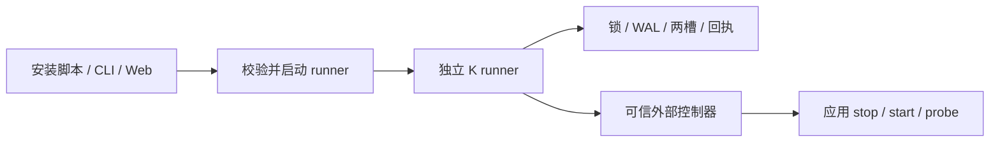

# K：外部升级框架设计

K 的唯一执行模型是独立的一次性 runner。应用提供生命周期控制和健康观测；事务引擎与可信适配器编译进 runner，应用不携带升级引擎。安装脚本、CLI 和 Web 控制面负责启动同一个 runner 协议，不实现另一套交换或回滚。

## 执行与信任边界

runner 位于应用两个槽之外，也必须在应用服务的进程管理范围之外。单纯 spawn 不能保证逃离 systemd cgroup 或 Windows job。runner 退出后可清理代码，持久状态必须保留；断电后由外部 supervisor 或操作者重新启动 runner 并请求 recover。

可信适配器在构建时固定，通过 `createRunner(options)` 配置事务。请求不能指定模块、任意命令或下载 URL。发布方负责来源认证、平台签名和 runner 分发；K 的 SHA-256 与大小检查证明字节完整，不替代来源认证。示例 runner 使用独立安装的 Node 24，原生打包由发布方负责。

## 代码组织

目录按职责划分，不按可选执行模式划分：

| 位置 | 职责 | 依赖边界 |
|---|---|---|
| `launcher/` | 获取、校验、运行和清理 runner | 使用工件下载与协议，不调用事务引擎 |
| `protocol/` | runner 的请求/响应类型和输入校验 | 共享数据契约，不启动进程、不修改状态 |
| `runner/` | stdin/stdout、命令执行、结果与退出码 | 调用事务接口，不负责下载自己 |
| `createRunner.ts` | 将发布源、宿主、策略和状态组合为 runner 使用的事务接口 | 唯一组装工厂，无转发包装 |
| `lifecycle/` | 应用停启、健康观测及命令控制器 | 控制器协议独立于 runner 请求协议 |
| `artifact/`、`txn/`、`converge/` | 下载与校验、持久事务与恢复、收敛证明 | 不依赖启动器或 stdin/stdout |

公开入口 `index.ts` 直接导出这些职责：`createRunner`、`launchRunner`、`serveRunner`、`executeRequest` 和 `createCommandHost`。不保留 external 模式、转发工厂或中间导出层。

## 事务与恢复

K 持有一个升级锁，保存 stable 和 experiment 两槽。工件验证完成后暂存 experiment，再执行交接、健康检查和收敛；通过才提交。stable 在候选评估期间保持可恢复。

服务事务相位为 idle、staged、handing-over、running-experiment、readback、promoted 或 rolled-back。WAL 在有副作用的操作之前记录意图。崩溃恢复不把存活的新进程视为已经提交：promote 意图尚未持久化时恢复 stable；promote 意图已持久化时幂等重放提交。恢复使用同一锁和状态，不重新下载工件。

锁冲突、损坏状态、未知格式和控制器超时不能报告成功。控制器的异步副作用必须在重试前被隔离；超时只表示结果不确定，不证明子进程已停止。

## 操作协议与回执

stdin 接收一条有大小上限的 JSON 请求，stdout 返回一条 JSON 响应。唯一动作是 upgrade、recover、status。升级明确指定 operation id、targetVersion 和布尔 consented。详细字段与退出码见 [协议](one-shot-runner.md#protocol-v1)。

`operation.json` 保存当前操作；开始下一笔操作前，在同一个锁内将终态归档到 `receipts/<sha256(operation-id)>.json`。回执描述事务结果，不承担消息送达确认。没有 ACK 动作、确认字段或确认门。

相同 id 和目标重放当前或归档结果，不重复下载或操纵服务；同一 id 换目标拒绝。新的尝试使用新的 id。查询成功与升级成功不同，历史成功与当前健康也不同。归档暂无自动清理策略。

## 生命周期与收敛

应用的字节替换和常驻服务交接都由独立执行方驱动。当前 createRunner 必须提供 HostAdapter，没有 profile 开关或无宿主默认值；正式接入示例覆盖常驻服务，CLI 字节替换夹具用于内部机制测试。

service 的 HostAdapter 提供 quiesce、stop、start、healthProbe、resume。quiesce 持久暂停工作，stop 返回前确认旧进程停止，start 幂等启动指定槽，healthProbe 从同一个活实例返回 version、pid、startId，resume 在候选或回滚槽恢复工作。start 返回不等于已就绪，只有 probe 能证明这一点。

二进制收敛不能用版本文件代替活进程证明。需要 OS 生命周期收敛的应用声明命名回读面；未声明的面不计通过。旧生命周期管理器只可在新面确实收敛后退役。这是平台所有权交接约束，不是另一种 K 执行模式。

## 策略、数据与可选能力

适配器声明安装所有权、同意策略、发布源、应用兼容性检查和通知出口。其他管理器拥有的安装返回 managed-elsewhere。远端调用必须在自身边界完成身份和同意校验，不能直接信任网络请求里的 consented。

K 回滚二进制，不回滚应用数据。发布方负责新旧数据格式、服务端协议以及破坏性迁移的备份恢复。工作负载连续性由 quiesce/resume 的实际实现证明，不是接入 K 自动获得的能力。

进度、provenance 和可选 fleet 驱动投影同一事务状态。UI 不维护第二套升级状态机；远程触发也通过外部 runner 执行。K 不提供包依赖求解、通用网络鉴权服务或 OS 镜像升级。

## 验证与接入

[接入指南](integration.md) 和 [external-service 示例](../examples/external-service/README.md) 描述唯一支持的接法。真实进程测试覆盖升级、错误候选回滚、runner 死亡、离线恢复及回执重放；核心和 harness 测试覆盖事务、平台与收敛机制。测试夹具直接调用内部引擎不构成应用接入接口。

执行 `pnpm check` 检查类型、lint、ratchets 和完整测试；`pnpm test:runner` 运行外部协议与真实进程验收。框架测试不代替产品在目标机器上的接入验收，也不表示 Computer 已发布或部署。
