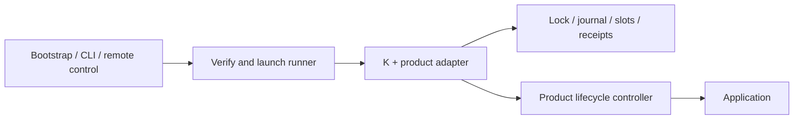

# K design

This document is the normative contract for K's execution model, transaction,
supervision and controller boundary. It states obligations; it does not
explain them. Read [how an upgrade works](guide.md) first for the narrative
and vocabulary, and the [reference](reference.md) for wire formats, exit
codes, budgets and file layout.

## Execution and trust

- The runner and its runtime live outside the application slots and service
  unit. Stopping the application must leave the worker alive. A child
  process can still belong to a systemd cgroup or Windows job; the publisher
  must arrange isolation.
- The supervisor retains recovery code until settlement. Installation state
  persists. An OS hook or operator must restart installation after reboot.
- The adapter is fixed at build time. Requests select an action and a target
  version, never code, commands or download URLs.
- The publisher authenticates distribution metadata and caller authority. K
  checks artifact SHA-256 and size; these checks do not establish publisher
  identity. See [packaging](integration.md#distribute-a-built-installer).

## Components

Paths are relative to `core/src/`.

| Component | Responsibility |
|---|---|
| `launcher/` | Acquire, verify, execute and clean runner code; supervise recovery |
| `protocol/` | Validate the bounded request/response contract |
| `runner/` | Serve stdin/stdout, execute requests and map outcomes to exit codes |
| `createRunner.ts` | Assemble source, host, policy and transaction state |
| `lifecycle/` | Stop/start/probe the application, including command-based control |
| `artifact/`, `txn/`, `converge/` | Verified acquisition, durable transactions and readiness predicates |

`createRunner(options)` constructs the transaction interface. `serveRunner(factory)`
serves it in the runner process. `launchRunner({release, request, scratchDir,
interpreter?})` verifies and supervises a worker, writes one final response and
returns its exit code. `superviseRunner` returns the same result as data,
including any retained `recoveryFile`. `resumeRunner(recoveryFile)` verifies
that retained runner and performs operation-bound recovery without
distribution access.

## Transaction and recovery

Each installation has one lock, stable and experiment executable slots, and a
journal. K stages verified candidate bytes, quiesces work, stops the old
service, starts the candidate and evaluates live readiness. Passing candidates
are promoted; failed candidates restore stable. Application data belongs
outside the slots.

The phases are `idle`, `staged`, `handing-over`, `running-experiment`,
`readback`, `promoted` and `rolled-back`. Intent is journaled before effects.
Recovery takes the same lock and uses existing slot bytes without release
lookup:

- Before durable promote intent: restore stable.
- After durable promote intent: replay commit idempotently.

A running candidate alone does not authorize commit. Corrupt or unknown state,
and another live lock owner, prevent conflicting operations. Filesystem
durability and controller behavior determine the real platform guarantees.

## Transaction completion

**Required for the initial release.** Every started operation has an owner
that waits for a durable terminal result or explicitly reports unresolved
recovery. An installer invocation must first settle unfinished work before
admitting a new upgrade. Recovering an interrupted operation does not retry
its requested upgrade.

The supervisor:

- runs outside the application service unit;
- retains the verified runner while the operation is active;
- enforces execution and recovery budgets ([values](reference.md#supervisor-budgets));
- starts a recovery worker after an abnormal exit;
- stops supervising after completion or an explicit unresolved result.

Recovery attempts and total elapsed time are bounded. Exhaustion preserves
state and provides a recovery command rather than reporting success.

Before starting a successor, the supervisor must observe the prior worker
exit. The recovery worker then takes the lock and fences outstanding
controller effects before replaying lifecycle actions. An expired deadline
alone is insufficient; an unconfirmed exit forbids takeover.

Recovery must bind to the original operation id under K's transaction lock.
If another operation has since run, recovery inspects or replays the original
result without modifying the newer operation. Recovery reuses the existing
journal and receipts; supervision does not create another transaction log.

Cleanup follows settlement: persist the outcome, release owned resources,
then remove disposable code. Never delete slots, a live owner's lock, or
recovery logs to make an interrupted operation appear complete. If recovery
remains unresolved, preserve the evidence and a verified means to invoke it
again. Installer startup handles leftover work; machine reboot still requires
an OS hook or operator to start the installer.

Every engine host call has a positive budget. Uncertain effects retain the
worker's lock until it exits. Bundled workers exit after flushing their
response; custom in-process callers must also exit on `HostCallUncertain`
rather than reuse that worker.

The lock is a local filesystem protocol requiring atomic creation and
coherent directory reads ([details](reference.md#lock-protocol)). It is not a
distributed or NFS lock. Operation ids, receipt archival and replay rules are
in the [reference](reference.md#receipts-and-retries).

## Host control contract

`createRunner` requires a HostAdapter. Its operations and the controller's
obligations:

| Operation | Controller obligation |
|---|---|
| fence | Drain or fence previous controller effects; required when effects can outlive the worker |
| quiesce | Stop admission and durably park promised workloads; repeated calls safe |
| stop | Stop the specified slot's service and confirm termination |
| start | Start the selected artifact idempotently, without creating duplicate residents |
| healthProbe | Return version, pid and startId from one ready live instance |
| resume | Restore parked work on either candidate or rolled-back stable |

- The controller must work while the old application is down.
- `start` returning does not establish readiness; the probe does.
- A stateless service satisfies `quiesce` and `resume` by acknowledging. The
  obligations apply to workloads the product promises to preserve.
- Adapters with no effects surviving their worker may omit `fence`. All
  other adapters must supply it and test it against their real service
  manager. `createCommandHost` always delivers `fence`; a command controller
  that queues nothing acknowledges it.
- If OS lifecycle surfaces are declared, K also requires them to reference
  the promoted artifact before retiring their previous manager. Undeclared
  surfaces are not observed.

`createCommandHost` runs an external controller via argv without a shell,
records the controller pid durably before each call, and drains recorded
controllers before `fence` during recovery. Wire format, bounds and pid
handling are in the [reference](reference.md#command-controller-protocol).
The recorded pid is never used to kill an arbitrary process. `fence`
acknowledgement is a product contract, not something K infers from process
exit. Fire-and-forget stop cannot establish termination.

## Product responsibilities

The adapter defines release lookup, installation ownership, consent,
notification and compatibility policy. Package-manager-owned installations
defer to their owner. K restores executables; products provide data-migration
compatibility, backup and restore, and any promised workload continuity.
Service upgrades can interrupt availability. Remote authorization,
distribution channels and cloud reconnection belong to the product
integration.

Use the [integration guide](integration.md) and
[service example](../examples/external-service/README.md) to build an
installer. The [test plan](test-plan.md) describes framework and product
acceptance; [prior art](prior-art/design-influences.md) records design
influences.
