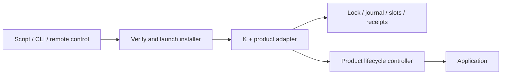

# K design

K executes installation transactions in an independent, disposable runner built
with a trusted product adapter. Scripts, CLI commands and remote controls launch
that runner. The application provides lifecycle operations and health evidence.

## Execution and trust



The runner and its runtime live outside the application slots and service unit.
Stopping the application must leave the runner alive. A child process can still
belong to a systemd cgroup or Windows job; the publisher must arrange isolation.
The runner's code can be cleaned after exit; its installation state persists.
An external supervisor or operator triggers recovery after a crash or reboot.

The adapter is fixed at build time. Requests select an action and target version,
not code, commands or download URLs. The publisher authenticates distribution
metadata and caller authority. K checks artifact SHA-256 and size; these checks
do not establish publisher identity. See [packaging](integration.md#distribute-a-built-installer).

## Components

Paths are relative to `core/src/`.

| Component | Responsibility |
|---|---|
| `launcher/` | Acquire, verify, execute and clean installer code |
| `protocol/` | Validate the bounded request/response contract |
| `runner/` | Serve stdin/stdout, execute requests and map outcomes to exit codes |
| `createRunner.ts` | Assemble source, host, policy and transaction state |
| `lifecycle/` | Stop/start/probe the application, including command-based control |
| `artifact/`, `txn/`, `converge/` | Verified acquisition, durable transactions and readiness predicates |

`createRunner(options)` constructs the transaction interface. `serveRunner(factory)`
serves it in the installer process. `launchRunner({release, request, scratchDir,
interpreter?})` downloads under bounded transfer budgets, verifies bytes, executes
in a private temporary child directory, waits for exit and cleans that directory.
It forwards stdout/stderr and supplies the request on stdin.

## Transaction and recovery

Each installation has one lock, stable/experiment executable slots and a journal.
K stages verified candidate bytes, quiesces work, stops the old service, starts
the candidate and evaluates live readiness. Passing candidates are promoted;
failed candidates restore stable. Application data belongs outside the slots.

The phases are idle, staged, handing-over, running-experiment, readback, promoted
and rolled-back. Intent is journaled before effects. Recovery takes the same
lock and uses existing slot bytes without release lookup:

- Before durable promote intent: restore stable.
- After durable promote intent: replay commit idempotently.

A running candidate alone does not authorize commit. Corrupt or unknown state
and another live lock owner prevent conflicting operations. Filesystem durability
and controller behavior determine the real platform guarantees.

## Protocol v1

One JSON request on stdin, one response on stdout, then exit. Decoded input is
bounded to 16,384 JavaScript string code units. Unknown fields/actions/versions,
invalid ids or targets, and nonboolean consent are rejected before the adapter
factory runs. Logs use stderr. Request ids and target strings are nonempty,
trimmed strings of at most 256 code units.

```json
{"protocolVersion":1,"action":"upgrade","id":"job-123","targetVersion":"2.0.0","consented":true}
```

The other requests are `{"protocolVersion":1,"action":"recover"}` and
`{"protocolVersion":1,"action":"status"}`. `consented` records approval already
obtained by an authenticated caller. Ownership and compatibility checks still apply.

| Action | Effect | Exit code |
|---|---|---|
| upgrade | Install the exact requested version; reject a mismatched source result | 0 promoted/up-to-date; 1 failure/rollback; 2 held; 3 unresolved |
| recover | Settle persisted work under the same lock | 0 successful/no recorded outcome; 1 recorded failure/rollback; 2 held receipt; 3 unresolved |
| status | Read the current receipt without lifecycle calls | 0 readable; 1 unreadable |

Execution replies contain `protocolVersion`, `action`, `result`, `exitCode`,
`operation` and `error`. Input rejection or adapter-construction failure may return
only `protocolVersion`, `result`, `exitCode` and `error`. Termination can leave no
complete response; inspect the persistent state and recover as needed.

Successful upgrade completion must match the request id and target. Exceptions
cannot manufacture a rollback receipt. Status exit 0 means readable, including
`genesis` (no recorded operation); it does not prove current health. Recovery can
return `result: "recovered"` with exit 1 after restoring stable and recording a
rolled-back upgrade. Always inspect the operation outcome.

## Receipts and retries

`operation.json` holds the current operation. Before starting another, K archives
a terminal receipt at `receipts/<sha256(operation-id)>.json` under the same lock.
Archive files currently have no automatic garbage collection.

An id binds to one target. Same-id terminal retries return the current or archived
result without repeating lifecycle effects; another target is rejected. Recovery
settles the interrupted operation, so retrying its id returns that outcome. A new
attempt, including one after a policy hold, needs a new id. Replayed results are
historical, not live health observations. Receipt retention is independent of
transport delivery. Unreadable records refuse operations; missing history cannot
be reconstructed. Status reads the current receipt, not an arbitrary archived id.

## Host control contract

`createRunner` requires a HostAdapter. Its operations are:

| Operation | Controller obligation |
|---|---|
| quiesce | Stop admission and durably park promised workloads; repeated calls safe |
| stop | Stop the specified slot's service and confirm termination |
| start | Start the selected artifact idempotently, without creating duplicate residents |
| healthProbe | Return version, pid and startId from one ready live instance |
| resume | Restore parked work on either candidate or rolled-back stable |

The controller must work while the old application is down. Start returning does
not establish readiness. If OS lifecycle surfaces are declared, K also requires
them to reference the promoted artifact before retiring their previous manager;
undeclared surfaces remain unobserved.

`createCommandHost` runs an external controller via argv, without a shell. Its
stdin is `{protocolVersion:1, action}` plus K-selected `slot` and `artifactPath`
for start/stop. Successful stdout is `{protocolVersion:1,ok:true}`; `probe` adds
`evidence:{version,pid,startId}`. Output is bounded to 64 KiB; calls have a positive
timeout, default 30 seconds. The command helper's own PID is invalid service
evidence, and reported errors exclude arbitrary stderr.

A timeout means uncertain effects. Controllers must fence outstanding asynchronous
work before recovery retries; fire-and-forget stop cannot establish termination.

## Product responsibilities

The adapter defines release lookup, installation ownership, consent, notification
and compatibility policy. Package-manager-owned installations defer to their
owner. K restores executables; products provide data-migration compatibility,
backup/restore and any promised workload continuity. Service upgrades can interrupt
availability. Remote authorization, distribution channels and cloud reconnection
belong to the product integration.

Use the [integration guide](integration.md) and [service example](../examples/external-service/README.md)
to build an installer. The [test plan](test-plan.md) describes framework and product
acceptance; [prior art](prior-art/design-influences.md) records design influences.
