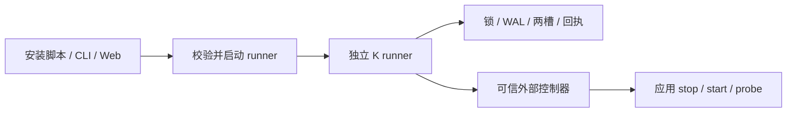

# K：外部升级框架设计

K 的唯一执行模型是独立的一次性 runner。应用提供生命周期控制和健康观测；事务引擎与可信适配器编译进 runner，应用不携带升级引擎。安装脚本、CLI 和 Web 控制面负责启动同一个 runner 协议，不实现另一套交换或回滚。

## 执行与信任边界



runner 位于应用两个槽之外，也必须在应用服务的进程管理范围之外。单纯 spawn 不能保证逃离 systemd cgroup 或 Windows job。runner 退出后可清理代码，持久状态必须保留；断电后由外部 supervisor 或操作者重新启动 runner 并请求 recover。

可信适配器在构建时固定，通过 `createRunner(options)` 配置事务。请求不能指定模块、任意命令或下载 URL。发布方负责来源认证、平台签名和 runner 分发；K 的 SHA-256 与大小检查证明字节完整，不替代来源认证。示例 runner 使用独立安装的 Node 24，原生打包由发布方负责。

## 设计取舍

参考 [prior art](prior-art/external-runner-research.md)，复用已有事务机制，保持外部执行边界。

| Candidate | Consequence | Decision |
|---|---|---|
| Add a permanent K service | K needs another installed lifecycle and updater | Unnecessary for this scope |
| Fresh helper calling old app's `upgrade` | Different PID, same dependency and old gates | Rejected |
| Fresh helper + external operations adapter + durable K state | App can be stopped or broken while operations continue | Implemented |
| General package manager | Adds dependency solving, package ownership and scripts | Outside scope; delegate to the owning manager |

## 代码组织

目录按职责划分，不按可选执行模式划分：

| 位置 | 职责 | 依赖边界 |
|---|---|---|
| `launcher/` | 获取、校验、运行和清理 runner | 使用工件下载与协议，不调用事务引擎 |
| `protocol/` | runner 的请求/响应类型和输入校验 | 共享数据契约，不启动进程、不修改状态 |
| `runner/` | stdin/stdout、命令执行、结果与退出码 | 调用事务接口，不负责下载自己 |
| `createRunner.ts` | 将发布源、宿主、策略和状态组合为 runner 使用的事务接口 | 唯一组装工厂，无转发包装 |
| `lifecycle/` | 应用停启、健康观测及命令控制器 | 控制器协议独立于 runner 请求协议 |
| `artifact/`、`txn/`、`converge/` | 下载与校验、持久事务与恢复、收敛证明 | 不依赖启动器或 stdin/stdout |

公开入口 `index.ts` 直接导出这些职责：`createRunner`、`launchRunner`、`serveRunner`、`executeRequest` 和 `createCommandHost`。不保留 external 模式、转发工厂或中间导出层。

## 启动安装器

`launchRunner({release, request, scratchDir, interpreter?})` implements the
bootstrap: download under bounded transfer budgets, check size and SHA-256,
write into a private temporary child directory, execute, wait for exit, and
clean that directory. SHA checks integrity against the supplied manifest;
they are **not** a publisher signature. Scratch space and any interpreter must
be outside both application slots. An installer can use this API or its own
small equivalent bootstrap, but cannot add swap/rollback logic.

The subprocess helper inherits stdout/stderr and receives a request on stdin.
Use it from an operator shell or an independent supervisor. A service manager
that kills all descendants of the application will also kill a helper launched
inside that service unit; `spawn()` alone does not escape a cgroup or Windows
job. Web integration must have an external launch facility and query K state
on reconnect. K does not introduce an authenticated network API in this framework.

## 事务与恢复

K 持有一个升级锁，保存 stable 和 experiment 两槽。工件验证完成后暂存 experiment，再执行交接、健康检查和收敛；通过才提交。stable 在候选评估期间保持可恢复。

服务事务相位为 idle、staged、handing-over、running-experiment、readback、promoted 或 rolled-back。WAL 在有副作用的操作之前记录意图。崩溃恢复不把存活的新进程视为已经提交：promote 意图尚未持久化时恢复 stable；promote 意图已持久化时幂等重放提交。恢复使用同一锁和状态，不重新下载工件。

锁冲突、损坏状态、未知格式和控制器超时不能报告成功。控制器的异步副作用必须在重试前被隔离；超时只表示结果不确定，不证明子进程已停止。

## Protocol v1

One JSON request on stdin, one JSON response on stdout, then process exit.
Decoded input is bounded to 16,384 JavaScript string code units. Unknown fields, actions, wire versions, empty ids,
and nonboolean consent are refused before the adapter factory runs. Adapter
logs belong on stderr; stdout is reserved for the protocol.

```json
{"protocolVersion":1,"action":"upgrade","id":"job-123","targetVersion":"2.0.0","consented":true}
```

Other requests are `{"protocolVersion":1,"action":"recover"}` and
`{"protocolVersion":1,"action":"status"}`. `consented`
represents approval already obtained by the caller, not a request to bypass
ownership or compatibility. Never derive it from an unauthenticated Web body.

| Command | Effect | Exit meaning |
|---|---|---|
| upgrade | Exactly the requested version; core rejects a source returning another | 0 promoted/up-to-date; 1 failure/rollback; 2 policy hold; 3 unresolved operation |
| recover | Settle journal under the same lock, without release lookup/download | 0 successful/no recorded outcome; 1 recorded failure/rollback; 2 held receipt; 3 still unresolved |
| status | Read the current operation, no lifecycle calls | 0 readable (inspect outcome); 1 unreadable |

Responses contain the original K `operation` and any error. Exception handling
never invents a `rolled-back` outcome. A nonzero controller exit, timeout,
process signal, missing receipt, or wrong request/target binding cannot become
successful upgrade completion. A successful **status query** is not successful
upgrade. A replay describes a historical operation, not current live health.

A response with `result: "recovered"` and an operation outcome of `rolled-back`
uses exit code 1: recovery restored stable, but the requested upgrade did not
succeed. A held receipt maps to 2. For status, exit 0 only means the receipt was
readable, including `operation.kind: "genesis"` (no recorded operation).

Successful execution replies contain `protocolVersion`, `action`, `result`,
`exitCode`, `operation` and `error`. Rejected input or adapter construction failure
may produce only `protocolVersion`, `result`, `exitCode` and `error`; clients must
not assume an operation exists on that error path. Runner termination can leave
no complete response: query status and recover the existing state as needed.

## Receipts, retry and recovery

`operation.json` holds the current operation. Before replacing a terminal receipt,
K archives it at `receipts/<sha256(operation-id)>.json` under the same upgrade lock.
Receipts record transaction outcomes, not transport delivery. There is no ACK action
or field. Active operations and corrupt state still block conflicting work.

An id binds to one target. Same-id terminal replay returns the current or archived
receipt without download or lifecycle actions; changing the target fails. After
recovery settles an interrupted id, retry returns that result. Use a fresh id for
a fresh attempt, including an approved attempt after a policy hold.

The runner checks persisted state format and receipt shape. Unreadable records
refuse before recovery begins. Missing history cannot be reconstructed. Archive
files have no automatic GC. File sync plus rename uses the platform durability
primitives; physical power-cut guarantees still depend on filesystem semantics.

## 生命周期与收敛

当前 `createRunner` 必须提供 HostAdapter，没有 profile 开关或无宿主默认值；正式接入示例覆盖常驻服务，CLI 字节替换夹具用于内部机制测试。

二进制收敛不能用版本文件代替活进程证明。需要 OS 生命周期收敛的应用声明命名回读面；未声明的面不计通过。旧生命周期管理器只可在新面确实收敛后退役。

## Host control contract

`createCommandHost` is the included adapter for an external controller. It uses
argv directly, never a shell; stdin contains `{protocolVersion:1, action}` and,
for start/stop, a K-selected `slot` and `artifactPath`. Stdout must be
`{protocolVersion:1,ok:true}`; `probe` additionally returns
`evidence:{version,pid,startId}`. Output is capped at 64 KiB and each command has
a positive bounded timeout (30 s default). The helper's own PID is invalid
service evidence. Controller failure messages exclude arbitrary stderr.

| Control | Application/controller obligation |
|---|---|
| quiesce | Stop admission and durably park workloads; repeated calls safe |
| stop | Stop the resident and confirm it is stopped before returning |
| start | Start specified artifact; repeated calls must not create a second resident |
| probe | Wait for readiness within budget; answer from one live incarnation, not metadata files |
| resume | Unpark work on either candidate or rolled-back stable |

If the service is already down, quiesce/stop should be idempotent; start and
probe must still work without old code. A command timeout means uncertainty,
not proof that its descendants or external effects stopped. The framework
leaves the transaction recoverable; controller implementations must fence any
asynchronous effects before a later recovery. Do not use a detached fire-and-
forget command as a successful stop.

## 策略、数据与可选能力

适配器声明安装所有权、同意策略、发布源、应用兼容性检查和通知出口。其他管理器拥有的安装返回 managed-elsewhere。远端调用必须在自身边界完成身份和同意校验，不能直接信任网络请求里的 consented。

K 回滚二进制，不回滚应用数据。发布方负责新旧数据格式、服务端协议以及破坏性迁移的备份恢复。工作负载连续性由 quiesce/resume 的实际实现证明，不是接入 K 自动获得的能力。

进度、provenance 和可选 fleet 驱动投影同一事务状态。UI 不维护第二套升级状态机；远程触发也通过外部 runner 执行。K 不提供包依赖求解、通用网络鉴权服务或 OS 镜像升级。

## 验证与接入

[接入指南](integration.md) 和 [external-service 示例](../examples/external-service/README.md) 描述唯一支持的接法。真实进程测试覆盖升级、错误候选回滚、runner 死亡、离线恢复及回执重放；核心和 harness 测试覆盖事务、平台与收敛机制。测试夹具直接调用内部引擎不构成应用接入接口。

执行 `pnpm check` 检查类型、lint、ratchets 和完整测试；`pnpm test:runner` 运行外部协议与真实进程验收。框架测试不代替产品在目标机器上的接入验收，也不表示 Computer 已发布或部署。


`core/src/runner/process.test.ts` builds the helper, starts a real HTTP
service with no K import, upgrades it, verifies PID/startId/version and stable
slot, tries a hash-valid artifact reporting a wrong version, and checks actual
rollback. It kills the helper **after stop and before start**, verifies a
concurrent helper is refused, removes the distribution manifest, and recovers
with a newly launched helper. It also verifies current and archived replay,
terminal receipt preservation and id/target conflicts.

`core/src/launcher/launch.test.ts` proves mismatched helper bytes never
execute and completed helper bytes are cleaned. Protocol/runner/controller
tests cover version rejection, missing success receipt, exception evidence,
nonzero commands, malformed probes and timeout.

Linux real-process tests run locally and in the existing suite. macOS/Windows
use the existing CI/platform lanes; this framework does not claim live Computer
migration, Windows native self-delete behavior or publication of a Computer
alpha. The new example proves an external service integration, not fleet rollout.
