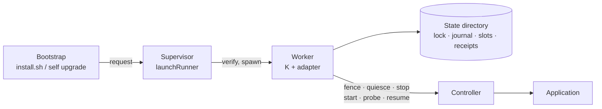
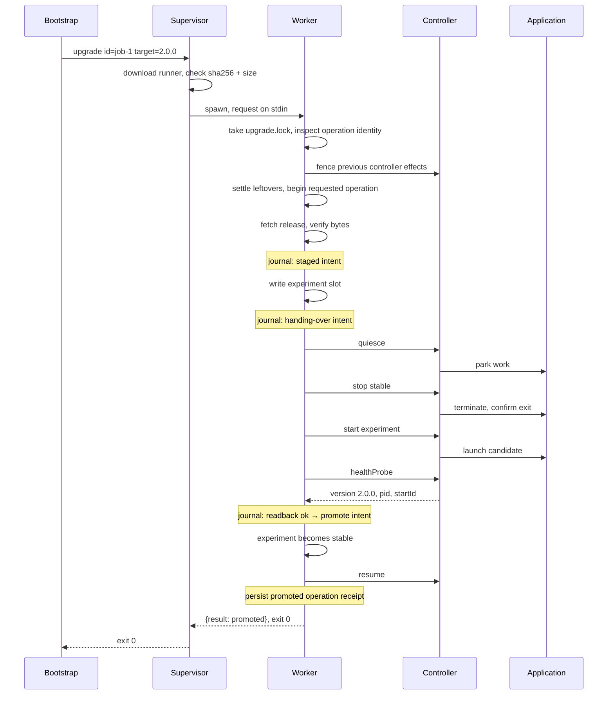
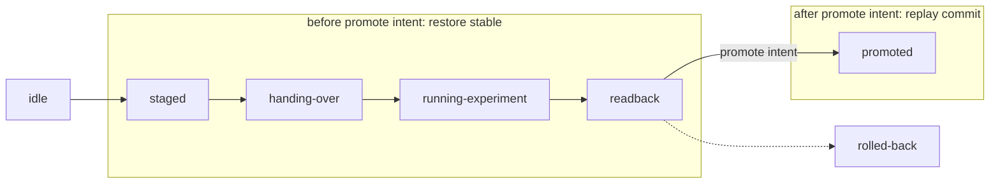

# How an upgrade works

This is the narrative walkthrough of K's mechanism: which processes exist,
what happens in what order, what breaks, and how to read the result. It is
written to be read once, top to bottom. It is **not** the contract; where it
and the [design](design.md) or [reference](reference.md) disagree, they win.

For what K is for and whether you need it, read the [README](../README.md).
For how to build and ship an installer, read the
[integration guide](integration.md). Terms are defined where they first
appear in bold; this document is the vocabulary the other documents use.

## The pieces

- The **bootstrap** is your `install.sh`, or the `self upgrade` command inside
  your application. It downloads and verifies the installer, launches it,
  and relays the exit code. It contains no upgrade logic.
- The **installer** is what you ship. It has two halves. The **supervisor**
  is a temporary process that acquires and verifies the runner, executes it
  and, if it dies, runs bounded recovery. The **runner** is K plus your
  adapter bundled into one executable; it serves one request and exits. A
  running runner is a **worker**.
- The **adapter** is your trusted code, fixed at build time: where releases
  come from, whether an upgrade may proceed, and how to reach the controller.
- The **controller** is your program that actually stops, starts and probes
  the application. The adapter can call it directly or through `createCommandHost`.
- The **state directory** holds the lock, the journal, two **slots** and the
  receipts. Recovery uses this state together with a compatible runner, its
  runtime and the product controller; it does not need release distribution.

The runner and the controller live outside the application's service unit.
That is the whole point: stopping the application must not stop the thing
that is upgrading it.

The slots are **stable** and **experiment**; these are positions
on disk, not release channels, so a product channel also called "stable" is
unrelated. *Hands*, mentioned in the integration guide, is the release
platform K's authors publish with; K does not depend on it.

## One upgrade, start to finish

In words:

1. The bootstrap asks the supervisor for one operation: an id and a target
   version. The id is what everything else binds to.
2. The supervisor downloads the runner, checks its hash and size, writes it
   to scratch space and runs it with the request on stdin.
3. The worker takes the installation lock. If an earlier operation was left
   unfinished, it settles that first. The same id replays its result; a new
   id may proceed only after recovery succeeds.
4. It asks your release source for exactly the target version, verifies the
   bytes, and writes them into the *experiment* slot. Nothing running has
   changed yet.
5. It asks the controller to quiesce (park in-flight work) and to stop the
   current service, and waits for confirmation that the old process is gone.
6. It asks the controller to start the candidate from the experiment slot,
   then probes it. The probe must come from one live process and report the
   expected version with a pid and a **startId**, so a stale process or a
   cached answer cannot pass.
7. Only now does the worker write **promote intent** to the journal. That
   line is the point of no return: before it, the safe move is always to put
   the old version back; after it, the safe move is always to finish the
   promotion.
8. Experiment becomes stable. The controller resumes parked work. The
   receipt is persisted in `operation.json`; it is archived before a later
   operation begins. The worker prints its response and exits 0.

The transaction journal phases are, in order: `idle`,
`staged`, `handing-over`, `running-experiment`, `readback`, and then either
`promoted` or `rolled-back`. Operation receipts additionally track stages such as
`downloading` and policy outcomes such as `held`.

## When something goes wrong

### The candidate is bad

It does not start, it reports the wrong version, or it never passes the probe.
The worker stops it, starts stable again, resumes parked work, and records
`rolled-back`. Exit code 1. The stable bytes were never touched. This is the
routine failure and the one K is built around.

### The worker dies

A crash, a kill, or a budget timeout. The supervisor:

1. terminates a timed-out worker and waits for its observed exit; a deadline
   alone does not permit takeover;
2. starts a recovery worker bound to the same operation id;
3. that worker takes the transaction lock, checks the operation identity,
   and asks the controller to **fence** before replaying lifecycle effects.
   Fencing ensures actions queued by the earlier worker cannot land later.
   An already terminal original operation simply replays its receipt.

Recovery does not need the network and does not guess. It reads the journal:

Before promote intent, recovery restores stable. After it, recovery replays
the commit. Both are idempotent, so a crash *during* recovery is handled the
same way next time. Recovery never starts a new upgrade, even if the original
request was an upgrade.

Attempts and elapsed time are bounded. If recovery does not settle within
those bounds, the supervisor exits 3, leaves the verified runner and a
`recovery.json` in scratch space, and prints where. Later, `resumeRunner` on
that file retries the same recovery offline.

### Everything dies

Power loss, reboot, or the whole invocation killed. The state directory
survives. The next installer invocation, whether from `install.sh`, from
`self upgrade`, or from an operator, settles the unfinished operation before
it accepts new work. K does not install a permanent watchdog, so *something*
has to run the installer again: your product's OS startup hook, or a person.

## Reading the result

Every run prints one JSON response on stdout and returns an exit code.
Inspect both. The short version:

| Exit | Meaning | What to do |
|---|---|---|
| 0 | Successful upgrade outcome; readable status or recovery with no recorded outcome | Check the action and receipt |
| 1 | Rolled back, or failed before any change | Read `operation.operation.outcome` and the reason |
| 2 | Held by policy, ownership or compatibility | Nothing changed; a new attempt needs a new id |
| 3 | Unresolved | Keep the recovery file and run recovery |

Two things surprise people. First, a `recover` action that successfully
restored stable after a bad candidate exits **1**, because the recorded
outcome is a rolled-back upgrade. That is the honest answer. Second, `status`
reads the last receipt, not the live service; it can say `genesis` (no
operation ever recorded) on a machine that is running fine.

The exact response shape and every exit code are in the
[reference](reference.md#protocol-v1).

What each step asks of your controller, and how to package and ship the
result, is the [integration guide](integration.md).
