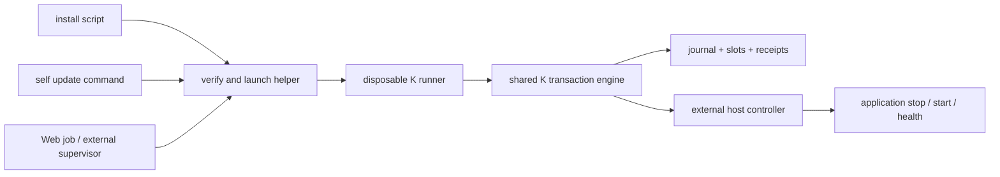

# K as an external upgrade framework

Status: implemented in this repository; application integration and production
publication are separate. This supersedes the embedded-executor recommendation
in design-v1 §5.0 for **new integrations**. Existing `createUpgrader` consumers
continue using the same engine and default receipt policy.

[中文图解](external-runner.html) · [研究来源](external-runner-research.md)

## The decision

An upgrade is an operation *on* a program. The owner of that operation must
survive stopping the program. K therefore supplies a disposable runner,
protocol, verified bootstrap, external host controller, and retained receipts.
The application supplies observations and lifecycle controls, not another
upgrade state machine. This removes the dependency on the old application's
upgrade code being healthy enough to install its replacement.



The runner is a process outside the application slots and service process tree.
The example builds one JavaScript file requiring an independently installed
Node 24. The build contains K and a trusted application adapter. The application
binary contains **no K dependency**. Native packaging (SEA or another publisher
build system) can wrap the same entry point; this PR does not publish a native
artifact or require a permanently installed K daemon.

“Disposable” describes code lifetime, **not state lifetime**. After a helper
crash, download the helper again and send `recover`; the persisted transaction
remains. A power failure requires an external boot/supervisor hook or operator
to invoke recovery. A dead helper cannot schedule its own replacement.

## Source research and what we take from it

The source-level comparison is in [external-runner-research.md](external-runner-research.md).
The conclusion is narrower than “copy rustup”: borrow the external executable
boundary, retain K's shared transaction engine, and explicitly preserve the
application's data compatibility and recovery obligations.

| Candidate | Consequence | Decision |
|---|---|---|
| Keep upgrading from the resident process | Success kills the transaction owner; rescue depends on old code | Superseded for new integrations |
| Add a permanent K service | K needs another installed lifecycle and updater | Unnecessary for this scope |
| Fresh helper calling old app's `upgrade` | Different PID, same dependency and old gates | Rejected |
| Fresh helper + external operations adapter + durable K state | App can be stopped or broken while operations continue | Implemented |
| General package manager | Adds dependency solving, package ownership and scripts | Outside scope; delegate to the owning manager |

K covers release acquisition, integrity, transaction locking, staging, process
handoff, health evaluation, rollback and history. It does not make application
data migrations reversible, preserve sessions automatically, authenticate an
untrusted release manifest, or guarantee uninterrupted service. Application
owners implement compatibility checks before staging and idempotent
quiesce/resume for their workloads. Destructive data migrations require their
own backup/restore contract; binary rollback alone cannot reverse them.

## Runnable integration

Implement a trusted adapter returning `createExternalUpgrader(options)`. This
uses **the existing** `createUpgrader` engine with `terminalReceiptPolicy:
"archive"`; there is no second transaction journal or parallel job state.

```sh
# Node 24 and pnpm; build the example adapter into a disposable executable.
pnpm install --frozen-lockfile
node scripts/build-runner.mjs examples/external-service/adapter.ts /tmp/k-runner.mjs
# See examples/external-service/README.md for preparing the example state.
printf '%s' '{"protocolVersion":1,"action":"status"}' | node /tmp/k-runner.mjs
```

The adapter is bound at **build time**, not selected by request JSON. Bundle it
with the helper's release and verify that artifact before executing it. A
request cannot supply code paths, arbitrary shell commands or release URLs.
Release selection/authentication and installed-directory authority remain in
the trusted adapter. Do not run an adapter received from an untrusted caller.

`execOneShotRunner({release, request, scratchDir, interpreter?})` implements the
bootstrap: download under bounded transfer budgets, check size and SHA-256,
write into a private temporary child directory, execute, wait for exit, and
clean that directory. SHA checks integrity against the supplied manifest;
they are **not** a publisher signature. Scratch space and any interpreter must
be outside both application slots. An installer can use this API or its own
small equivalent bootstrap, but cannot add swap/rollback logic.

The subprocess helper inherits stdout/stderr and receives a request on stdin.
Use it from an operator shell or an independent supervisor. A service manager
that kills all descendants of the application will also kill a helper launched
inside that service unit; `spawn()` alone does not escape a cgroup or Windows
job. Web integration must have an external launch facility and query K state
on reconnect. K does not introduce an authenticated network API in this PR.

## Protocol v1

One JSON request on stdin, one JSON response on stdout, then process exit.
Input is bounded to 16 KiB. Unknown fields, actions, wire versions, empty ids,
and nonboolean consent are refused before the adapter factory runs. Adapter
logs belong on stderr; stdout is reserved for the protocol.

```json
{"protocolVersion":1,"action":"upgrade","id":"job-123","targetVersion":"2.0.0","consented":true}
```

Other requests are `{"protocolVersion":1,"action":"recover"}`, `status`, and
`{"protocolVersion":1,"action":"acknowledge","id":"job-123"}`. `consented`
represents approval already obtained by the caller, not a request to bypass
ownership or compatibility. Never derive it from an unauthenticated Web body.

| Command | Effect | Exit meaning |
|---|---|---|
| upgrade | Exactly the requested version; core rejects a source returning another | 0 promoted/up-to-date; 1 failure/rollback; 2 policy hold; 3 unresolved operation |
| recover | Settle journal under the same lock, without release lookup/download | 0 settled successfully; 1 recorded failure/rollback; 3 still unresolved |
| status | Read the current operation, no lifecycle calls | 0 readable (inspect outcome); 1 unreadable |
| acknowledge | Mark delivery of one exact current terminal receipt | 0 acknowledged; 2 missing/changed/nonterminal |

Responses contain the original K `operation` and any error. Exception handling
never invents a `rolled-back` outcome. A nonzero controller exit, timeout,
process signal, missing receipt, or wrong request/target binding cannot become
successful upgrade completion. A successful **status query** is not successful
upgrade. A replay describes a historical operation, not current live health.

## Receipts, retry and old state

The existing `operation.json` remains the current operation. In external mode,
before replacing a terminal receipt K persists it at
`receipts/<sha256(operation-id)>.json` under the same upgrade lock. An unsent
receipt is retained with `acknowledgedAtMs: null`; history retention does not
claim transport delivery. Active operations and corrupt state still block.
This removes the dependency on an old client returning to acknowledge before
another upgrade can begin. No receipt deletion or forced lock bypass exists.

An id binds to one target. Same-id terminal replay returns the current or
archived receipt **without download or lifecycle actions**; changing the target
under that id fails. After recovery settles an interrupted id, retry returns
its recovered outcome; a fresh attempt uses a fresh id. To continue after a
policy hold, submit the approved version with a new id. `OperationReplay` is
also exposed to embedded callers: code previously retrying the same terminal
id must consume this typed receipt instead of expecting another transaction.

New external helpers read the same v1 state layout and check receipt shape.
This is not a promise to accept every historical or future state format.
Unreadable current/archive records refuse before recovery begins. Existing
embedded adapters keep their ACK gate until deliberately migrated. Historical
receipts absent from disk cannot be reconstructed. Archive files are retained
without automatic GC; retention is an explicit future policy, not silent data
loss. File sync plus rename matches K's existing durability primitives; physical
power-cut durability still depends on filesystem semantics (directory fsync is
not added by this change).

## Host control contract

`createCommandHost` is the included adapter for an external controller. It uses
argv directly, never a shell; stdin contains `{protocolVersion:1, action}` and,
for start/stop, a K-selected `slot` and `artifactPath`. Stdout must be
`{protocolVersion:1,ok:true}`; `probe` additionally returns
`evidence:{version,pid,startId}`. Output is capped at 64 KiB and each command has
a positive bounded timeout (30 s default). The helper's own PID is invalid
service evidence. Controller failure messages exclude arbitrary stderr.

| Control | Application/controller obligation |
|---|---|
| quiesce | Stop admission and durably park workloads; repeated calls safe |
| stop | Stop the resident and confirm it is stopped before returning |
| start | Start specified artifact; repeated calls must not create a second resident |
| probe | Wait for readiness within budget; answer from one live incarnation, not metadata files |
| resume | Unpark work on either candidate or rolled-back stable |

If the service is already down, quiesce/stop should be idempotent; start and
probe must still work without old code. A command timeout means uncertainty,
not proof that its descendants or external effects stopped. The framework
leaves the transaction recoverable; controller implementations must fence any
asynchronous effects before a later recovery. Do not use a detached fire-and-
forget command as a successful stop.

## Failure boundaries and verification

The existing engine journals intent before stage/handoff/promote and retains
stable during candidate evaluation. Runner death during download, stop/start,
readback or terminal reporting leaves that same state for a new runner.
A bad candidate rolls back; a controller hang remains recovery-required;
unknown schemas and another live lock owner are refused.

`core/src/external/process.test.ts` builds the helper, starts a real HTTP
service with no K import, upgrades it, verifies PID/startId/version and stable
slot, tries a hash-valid artifact reporting a wrong version, and checks actual
rollback. It kills the helper **after stop and before start**, verifies a
concurrent helper is refused, removes the distribution manifest, and recovers
with a newly launched helper. It also verifies current and archived replay,
unacknowledged receipt preservation and id/target conflicts.

`core/src/external/bootstrap.test.ts` proves mismatched helper bytes never
execute and completed helper bytes are cleaned. Protocol/runner/controller
tests cover version rejection, missing success receipt, exception evidence,
nonzero commands, malformed probes and timeout.

Linux real-process tests run locally and in the existing suite. macOS/Windows
use the existing CI/platform lanes; this PR does not claim live Computer
migration, Windows native self-delete behavior or publication of a Computer
alpha. The new example proves an external service integration, not fleet rollout.
